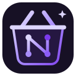

<h1 align="center">Nodus Research - Skill marketplace</h1>

Research methods. Creative tools. Shared possibilities.

Discover and share skills for the Nodus assistant and Nodi. Each skill is a self-contained directory with the same versioned manifest, instructions and optional tools.

In Nodus, open **Skills → Marketplace**. This repository is included by default. Select **Update catalog**, review a skill, install it, then enable it independently for Assistant or Nodi in **My skills**. You can add any number of public GitHub repository sources using the same format. Requires a Nodus build containing the marketplace integration; earlier releases support instruction-only imports.

Catalog updates do not change installed skills. Installing a replacement is explicit, replaces local edits and disables the skill until you enable it again. Repository snapshots are pinned to a commit. Removing a source keeps its installed skills.

[Create a skill](CONTRIBUTING.md) · [Package specification](SPECIFICATION.md) · [Marketplace rules](POLICY.md) · [Security](SECURITY.md)

AlphaGenome and Legalize are packaged from [Nodus PR #700](https://github.com/Drakonis96/nodus/pull/700). They require a build with their native integrations and marketplace capability routing; the PR is currently open. Builds without those capabilities cannot install them. See each package’s compatibility notes.

## Skills, tools and native capabilities

A skill is an installable package: metadata, instructions, expected behavior and a declaration of what the assistant may use. A tool is one concrete operation the assistant can invoke. A native capability is functionality implemented and controlled by Nodus itself, which exposes one or more privileged or specialized tools to compatible skills.

Most skills need nothing beyond their instructions. A skill may also ship ordinary sandboxed JavaScript tools for calculations, parsing, transformations and generators; those run inside the package, with no network, filesystem or credentials.

Advanced skills declare a native capability instead. The package never bundles or reproduces the external service. It states which capability it needs, and Nodus exposes the corresponding tools at runtime when the running build supports that capability and the user has permitted it. Native capabilities cover work that arbitrary marketplace code should not perform: external-service access, credential handling, authoritative-data retrieval, specialized validated computation and other deeper application integrations.

- [AlphaGenome](alphagenome/) is the skill; Nodus's native genomics capability performs the AlphaGenome integration.
- [Legalize](legalize/) is the skill; the native legal capability performs the reviewed legislation retrieval.
- [Chemistry Studio](chemistry-studio/) is the skill; native chemistry tooling performs the specialized validated chemistry operations.

Declaring a capability does not grant it. A package requests, Nodus decides: builds without the capability refuse installation, and the privileged tools never leave the trusted runtime. The layering is deliberate. Marketplace packages describe workflows; sensitive or specialized execution stays inside Nodus.

## Catalog

<!-- catalog:start -->

### Data analysis

<table>
<thead><tr><th width="190">App / skill</th><th width="125">Contributor</th><th width="505">Description</th></tr></thead>
<tbody>
<tr><td><a href="descriptive-statistics/">Descriptive Statistics</a></td><td><a href="https://github.com/Drakonis96">@Drakonis96</a></td><td>Calculate count, mean, median, range and population standard deviation from a supplied numeric sample.</td></tr>
</tbody>
</table>

### Law and legislation

<table>
<thead><tr><th width="190">App / skill</th><th width="125">Contributor</th><th width="505">Description</th></tr></thead>
<tbody>
<tr><td><a href="legalize/">Legalize</a></td><td><a href="https://github.com/Drakonis96">@Drakonis96</a></td><td>Find legislation in legalize-dev country repositories, preserving official sources, snapshot versions, licences and attribution. Requires the native integration from Nodus PR #700.</td></tr>
</tbody>
</table>

### Learning

<table>
<thead><tr><th width="190">App / skill</th><th width="125">Contributor</th><th width="505">Description</th></tr></thead>
<tbody>
<tr><td><a href="socratic-tutor/">Socratic Tutor</a></td><td><a href="https://github.com/Drakonis96">@Drakonis96</a></td><td>Guided learning through focused questions, progressive hints and personalized feedback.</td></tr>
</tbody>
</table>

### Science

<table>
<thead><tr><th width="190">App / skill</th><th width="125">Contributor</th><th width="505">Description</th></tr></thead>
<tbody>
<tr><td><a href="alphagenome/">AlphaGenome</a></td><td><a href="https://github.com/Drakonis96">@Drakonis96</a></td><td>AlphaGenome regulatory variant predictions for non-commercial research, with local plots and attributed exports. Requires a personal API key and the native integration from Nodus PR #700.</td></tr>
<tr><td><a href="chemistry-studio/">Chemistry Studio</a></td><td><a href="https://github.com/Drakonis96">@Drakonis96</a></td><td>Reference-backed molecular structures, Fischer/Haworth/Newman projections and bounded reaction mechanisms with validated ChemFig export.</td></tr>
</tbody>
</table>

### Thinking and writing

<table>
<thead><tr><th width="190">App / skill</th><th width="125">Contributor</th><th width="505">Description</th></tr></thead>
<tbody>
<tr><td><a href="action-planner/">Action Planner</a></td><td><a href="https://github.com/Drakonis96">@Drakonis96</a></td><td>Turn a goal into priorities, concrete steps and an achievable first action.</td></tr>
<tr><td><a href="brainstorm-studio/">Brainstorm Studio</a></td><td><a href="https://github.com/Drakonis96">@Drakonis96</a></td><td>Generate distinct ideas, then select and develop the most promising ones.</td></tr>
<tr><td><a href="compare-choose/">Compare &amp; Choose</a></td><td><a href="https://github.com/Drakonis96">@Drakonis96</a></td><td>Compare alternatives against explicit criteria and recommend a choice suited to your needs.</td></tr>
<tr><td><a href="constructive-critic/">Constructive Critic</a></td><td><a href="https://github.com/Drakonis96">@Drakonis96</a></td><td>Review a text, design or proposal and prioritize specific, practical improvements.</td></tr>
<tr><td><a href="make-it-simple/">Make It Simple</a></td><td><a href="https://github.com/Drakonis96">@Drakonis96</a></td><td>Explain complex material clearly with concrete examples and useful analogies.</td></tr>
<tr><td><a href="perspective-switcher/">Perspective Switcher</a></td><td><a href="https://github.com/Drakonis96">@Drakonis96</a></td><td>Explore different viewpoints and see which assumptions change the conclusions.</td></tr>
<tr><td><a href="thought-partner/">Thought Partner</a></td><td><a href="https://github.com/Drakonis96">@Drakonis96</a></td><td>Develop an unfinished idea, surface assumptions and find a useful way forward.</td></tr>
<tr><td><a href="writing-partner/">Writing Partner</a></td><td><a href="https://github.com/Drakonis96">@Drakonis96</a></td><td>Draft and refine clear, purposeful writing while preserving your voice and intent.</td></tr>
</tbody>
</table>

### Visual creation

<table>
<thead><tr><th width="190">App / skill</th><th width="125">Contributor</th><th width="505">Description</th></tr></thead>
<tbody>
<tr><td><a href="image-atelier/">Image Atelier</a></td><td><a href="https://github.com/Drakonis96">@Drakonis96</a></td><td>Original illustrations, concept art and visual scenes using your image model.</td></tr>
<tr><td><a href="svg-studio/">SVG Studio</a></td><td><a href="https://github.com/Drakonis96">@Drakonis96</a></td><td>Precise diagrams, explanatory drawings, maps, timelines and visual systems.</td></tr>
</tbody>
</table>

<!-- catalog:end -->

## Share your own workflow

Create a skill in Nodus, add its metadata and optional capabilities/tools, save it and select **Export**. Choose a parent directory; Nodus creates a new skill directory ready to copy to a repository root. You can also start from [the template](templates/example-skill/). Never put credentials or private research data in a package.

The official catalog is curated. Skills promoting illegal activity, piracy, license circumvention, malware or unauthorized access are prohibited. Automated format checks complement human review; passing validation is not approval. Independent sources are controlled by their maintainers and are not endorsed by Nodus.

## Maintainers

Run `node scripts/catalog.mjs` after changing a skill; CI checks package validity and catalog freshness with `node scripts/catalog.mjs --check`. The validator is generated from Nodus's shared package contract using `scripts/sync-skill-marketplace.mjs` in the application repository.

The repository uses [AGPL-3.0-only](LICENSE). Each manifest declares its package license. The Nodus name and logo identify the project; inclusion does not grant permission to imply endorsement of a third-party marketplace.
